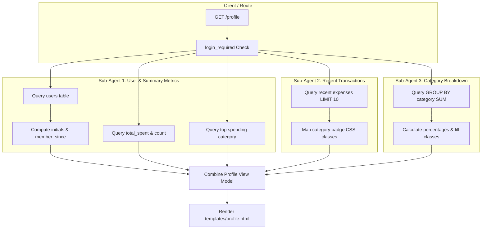

# Implementation Plan - 05 Adding Backend Connections to Profile

Connect the Spendly profile page (`/profile`) to the SQLite database to dynamically render authenticated user details, financial summary statistics, recent transactions, and category breakdown.

## Goal Description
In Step 04, the frontend profile UI layout was constructed using hardcoded mock dictionaries and lists. In this step (Step 05), we will wire up the `/profile` route handler in `app.py` to fetch and compute real user data from the SQLite database (`users` and `expenses` tables).

To achieve efficient and modular execution, the implementation is partitioned into **3 parallel sub-agent work streams**:
1. **`agent_1` (User Info & Summary Stats)**: Query user metadata (`name`, `email`, `created_at`), compute user initials (`DU`), format `member_since` date, calculate `total_spent`, `transaction_count`, and determine `top_category`.
2. **`agent_2` (Recent Transactions)**: Query the latest user transactions from the `expenses` table sorted by date descending, map category badge CSS classes, and handle empty transaction history states.
3. **`agent_3` (Category Breakdown)**: Query aggregate spend per category, compute relative percentages safely (preventing division by zero), map progress bar badge classes, and ensure empty states render cleanly.

---

## User Review Required

> [!IMPORTANT]
> - All SQL queries must use parameter placeholders (`?`) with `session["user_id"]` to prevent SQL injection vulnerabilities.
> - Accounts with zero recorded expenses must render cleanly without `ZeroDivisionError` or null pointer issues (`total_spent: 0.00`, `transaction_count: 0`, `top_category: "N/A"`).
> - Initial generation will gracefully support single names (e.g. "Ahmed" -> "A") and multi-part names (e.g. "Ali Tariq Khan" -> "AT" or "AK").

---

## Architecture & Sub-Agent Distribution



### Work Streams Breakdown

| Sub-Agent | Scope & Focus | Key Deliverables |
| :--- | :--- | :--- |
| **`agent_1`** | **User Info & Summary Stats** | - Query `users` for `name`, `email`, `created_at`<br>- Compute initials & format `member_since`<br>- Query aggregate `total_spent`, `transaction_count`, `top_category`<br>- Handle zero-expense fallback |
| **`agent_2`** | **Recent Transactions** | - Query recent expenses (`LIMIT 10`) for `user_id`<br>- Map categories to CSS badge classes (`badge-food`, `badge-bills`, etc.)<br>- Support empty state in table rendering |
| **`agent_3`** | **Category Breakdown** | - Query `GROUP BY category` sums for `user_id`<br>- Calculate percentage of total spending safely<br>- Map category bar fill classes (`badge-food-fill`, etc.)<br>- Support empty state list display |

---

## Proposed Changes

### Backend Application Layer

#### [MODIFY] [app.py](file:///home/jiggra/expense-tracker/app.py)

Update the `profile()` route handler:
1. Fetch logged-in user record:
   ```python
   user_row = db.execute("SELECT name, email, created_at FROM users WHERE id = ?", (user_id,)).fetchone()
   ```
2. Derive user initials and member since:
   ```python
   # Initials helper
   parts = user_row["name"].strip().split()
   initials = (parts[0][0] + parts[-1][0]).upper() if len(parts) > 1 else parts[0][:2].upper()
   
   # Member since formatting
   from datetime import datetime
   try:
       created_dt = datetime.strptime(user_row["created_at"][:10], "%Y-%m-%d")
       member_since = created_dt.strftime("%B %Y")
   except Exception:
       member_since = "March 2026"
   ```
3. Fetch summary metrics (`agent_1`):
   ```python
   summary_row = db.execute(
       "SELECT COALESCE(SUM(amount), 0.0) as total_spent, COUNT(*) as tx_count FROM expenses WHERE user_id = ?",
       (user_id,)
   ).fetchone()
   
   top_cat_row = db.execute(
       "SELECT category FROM expenses WHERE user_id = ? GROUP BY category ORDER BY SUM(amount) DESC, category ASC LIMIT 1",
       (user_id,)
   ).fetchone()
   
   top_category = top_cat_row["category"] if top_cat_row else "N/A"
   ```
4. Fetch recent transactions (`agent_2`):
   ```python
   recent_rows = db.execute(
       "SELECT id, date, description, category, amount FROM expenses WHERE user_id = ? ORDER BY date DESC, id DESC LIMIT 10",
       (user_id,)
   ).fetchall()
   
   badge_class_map = {
       "Food": "badge-food",
       "Transport": "badge-transport",
       "Bills": "badge-bills",
       "Health": "badge-health",
       "Entertainment": "badge-entertainment",
       "Shopping": "badge-shopping",
       "Other": "badge-other"
   }
   
   recent_transactions = [
       {
           "id": row["id"],
           "date": row["date"],
           "description": row["description"] or "—",
           "category": row["category"],
           "badge_class": badge_class_map.get(row["category"], "badge-other"),
           "amount": row["amount"]
       }
       for row in recent_rows
   ]
   ```
5. Fetch category breakdown (`agent_3`):
   ```python
   breakdown_rows = db.execute(
       "SELECT category, SUM(amount) as amount FROM expenses WHERE user_id = ? GROUP BY category ORDER BY amount DESC",
       (user_id,)
   ).fetchall()
   
   total_spent = summary_row["total_spent"]
   category_breakdown = [
       {
           "category": row["category"],
           "amount": row["amount"],
           "percentage": int(round((row["amount"] / total_spent * 100))) if total_spent > 0 else 0,
           "badge_class": badge_class_map.get(row["category"], "badge-other")
       }
       for row in breakdown_rows
   ]
   ```

---

### Template Layer

#### [MODIFY] [templates/profile.html](file:///home/jiggra/expense-tracker/templates/profile.html)

- Ensure empty states are gracefully rendered:
  - If `recent_transactions` is empty, show a clean empty table row: `<tr><td colspan="4" class="text-muted text-center">No transactions recorded yet.</td></tr>`.
  - If `category_breakdown` is empty, show a placeholder message: `<div class="text-muted">No spending categories to display.</div>`.
- Ensure category badge fill classes render consistently with `style.css`.

---

### Testing Layer

#### [MODIFY] [test_app.py](file:///home/jiggra/expense-tracker/test_app.py)

Extend tests to verify dynamic database values:
- `test_profile_dynamic_user_details`: Register a user, log in, visit `/profile`, assert user name, email, and computed initials match database record.
- `test_profile_dynamic_stats_calculation`: Add expenses via `/expenses/add`, assert total spent, transaction count, and top category reflect updated DB calculations.
- `test_profile_recent_transactions_live_db`: Assert recent transactions table lists dynamically inserted expenses sorted by date DESC.
- `test_profile_category_breakdown_dynamic`: Assert category amounts and computed percentages match the DB aggregations.
- `test_profile_empty_expenses_state`: Register a fresh user with 0 expenses, verify `/profile` loads with HTTP 200, `₹0.00` total spent, `0` transactions, `N/A` top category, and no errors.

---

## Verification Plan

### Automated Tests
Run pytest across all profile tests and complete test suite:
```bash
.venv/bin/python -m pytest test_app.py -k "profile" -v
.venv/bin/python -m pytest
```

### Manual Verification
1. Run server: `.venv/bin/python app.py`.
2. Register a new user: e.g. "Sarah Connor" (`sarah@test.com`).
3. View `/profile`: verify avatar `SC`, 0 total spent, 0 transactions, empty state messages.
4. Add transactions across multiple categories (Food: 500, Bills: 1500).
5. Refresh `/profile`: verify stats update to ₹2,000.00 total spent, Top Category "Bills" (75%), "Food" (25%).
