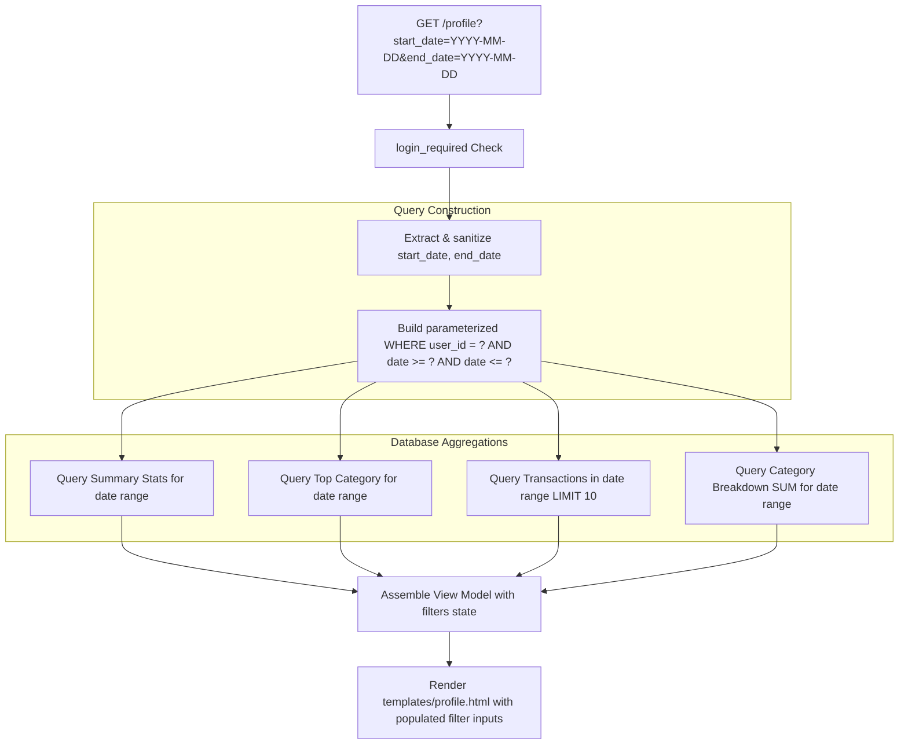

# Implementation Plan - 06 Date Filter for Profile Page

Add date range filtering (`start_date` and `end_date`) to the Spendly Profile page (`/profile`) so users can analyze their financial summary statistics, recent transactions, and category breakdown across custom time windows.

---

## Goal Description
Currently, the `/profile` page displays all-time statistics, the 10 most recent transactions, and all-time category breakdowns for the authenticated user. In this step (Step 06), we will add date filtering capability to `/profile` via `start_date` and `end_date` query parameters.

When a date filter is applied:
1. **Summary Stats** (`total_spent`, `transaction_count`, `top_category`) dynamically re-calculate based strictly on expenses within the selected date range.
2. **Recent Transactions** displays transactions occurring within the filtered date range.
3. **Category Breakdown** sums expenses and recalculates category spending percentages relative to the filtered total spent.
4. **Active Filters** are preserved in the form input fields, and a "Clear" button resets back to all-time view.

---

## User Review Required

> [!IMPORTANT]
> - **SQL Query Safety**: Dynamic query building must use parameterized conditions (`AND date >= ?` and `AND date <= ?`) with `?` placeholders. String formatting/concatenation of date values into SQL strings is strictly forbidden.
> - **Zero-Expense Graceful Handling**: When a selected date range has zero matching transactions, the page must render cleanly: `total_spent = 0.00`, `transaction_count = 0`, `top_category = "N/A"`, with empty state notices in transactions and category breakdown tables.
> - **Category Percentages**: Percentages must be safely computed against the *filtered* `total_spent` (with division-by-zero check).

---

## Architecture & Data Flow



---

## Proposed Changes

### Backend Application Layer

#### [MODIFY] [app.py](file:///home/jiggra/expense-tracker/app.py)

Update `profile()` route handler:
1. Extract `start_date` and `end_date` from `request.args`:
   ```python
   start_date = request.args.get("start_date", "").strip()
   end_date = request.args.get("end_date", "").strip()
   ```
2. Construct common filter clauses:
   ```python
   date_filter_sql = ""
   date_filter_params = []
   if start_date:
       date_filter_sql += " AND date >= ?"
       date_filter_params.append(start_date)
   if end_date:
       date_filter_sql += " AND date <= ?"
       date_filter_params.append(end_date)
   ```
3. Apply `date_filter_sql` and `date_filter_params` to:
   - Summary query (`SUM(amount)`, `COUNT(*)`)
   - Top category query (`SELECT category FROM expenses WHERE user_id = ? ... GROUP BY category`)
   - Recent transactions query (`SELECT ... FROM expenses WHERE user_id = ? ... ORDER BY date DESC, id DESC LIMIT 10`)
   - Category breakdown query (`SELECT category, SUM(amount) ... WHERE user_id = ? ... GROUP BY category`)
4. Pass `filters={"start_date": start_date, "end_date": end_date}` to `render_template("profile.html", ...)`.

---

### Template Layer

#### [MODIFY] [templates/profile.html](file:///home/jiggra/expense-tracker/templates/profile.html)

Add a Date Filter toolbar between the user information card and summary stats:
```html
<div class="profile-filter-card">
    <form method="GET" action="{{ url_for('profile') }}" class="profile-filter-form">
        <div class="filter-group">
            <label for="start_date" class="filter-label">From</label>
            <input type="date" id="start_date" name="start_date" class="form-input filter-input" value="{{ filters.start_date }}">
        </div>
        <div class="filter-group">
            <label for="end_date" class="filter-label">To</label>
            <input type="date" id="end_date" name="end_date" class="form-input filter-input" value="{{ filters.end_date }}">
        </div>
        <div class="filter-actions">
            <button type="submit" class="btn btn-primary btn-sm">Filter</button>
            
            <a href="{{ url_for('profile') }}" class="btn btn-outline btn-sm">Clear</a>
            
        </div>
    </form>
</div>
```

---

### Styling Layer

#### [MODIFY] [static/css/style.css](file:///home/jiggra/expense-tracker/static/css/style.css)

Add styling for `.profile-filter-card`, `.profile-filter-form`, `.filter-group`, and `.filter-actions` using existing CSS variables:
- Use `var(--paper-card)`, `var(--border)`, `var(--radius-md)`, `var(--font-sans)`.
- Ensure responsive wrapping on mobile (`@media (max-width: 640px)`).

---

### Testing Layer

#### [MODIFY] [test_app.py](file:///home/jiggra/expense-tracker/test_app.py)

Add test cases covering date filtering on `/profile`:
1. `test_profile_date_filter_range`: Add expenses on different dates (e.g. 2026-01-15, 2026-02-15, 2026-03-15). Query `/profile?start_date=2026-02-01&end_date=2026-02-28`. Assert only February expense is included in total spent, transaction count, and recent transactions.
2. `test_profile_date_filter_start_only`: Query with `start_date=2026-02-01`. Assert expenses on or after Feb 1 are included.
3. `test_profile_date_filter_end_only`: Query with `end_date=2026-02-01`. Assert expenses on or before Feb 1 are included.
4. `test_profile_date_filter_no_results`: Query with a date range in the future where no expenses exist. Verify 200 OK, ₹0.00 total spent, 0 transactions, "N/A" top category, and clean empty state message.
5. `test_profile_date_filter_form_persistence`: Assert `start_date` and `end_date` values appear in input values in the rendered HTML response.

---

## Verification Plan

### Automated Tests
Run pytest to verify implementation:
```bash
.venv/bin/python -m pytest test_app.py -k "profile" -v
.venv/bin/python -m pytest
```

### Manual Verification
1. Start Flask app: `.venv/bin/python app.py`.
2. Log in with demo account (`demo@spendly.com` / `demo123`).
3. Navigate to `/profile`.
4. Apply date filter (e.g. `2026-03-01` to `2026-03-10`).
5. Confirm Total Spent, Transactions count, Top Category, Recent Transactions table, and Category Breakdown update accurately.
6. Click "Clear" and confirm all-time statistics return.
