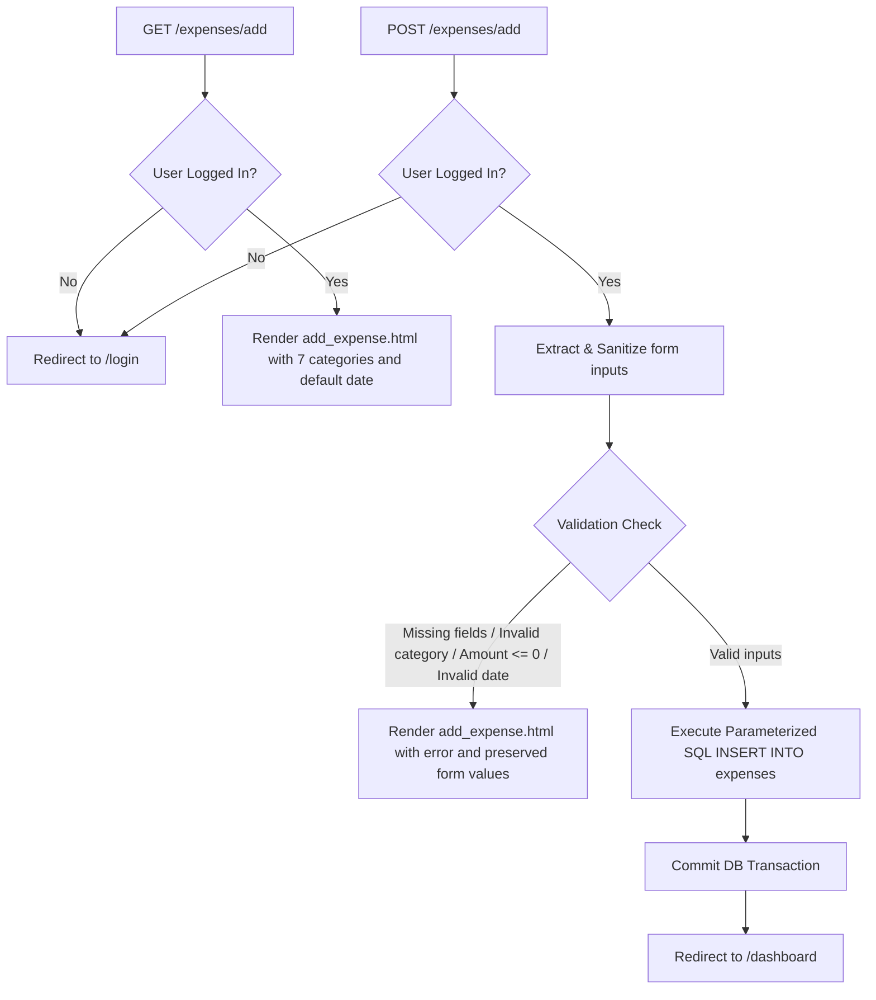

# Implementation Plan - 07 Add Expense

Enhance and complete the Add Expense feature (`/expenses/add`) in Spendly to allow authenticated users to log new expense transactions with category selection, amount, date, and optional description, complete with robust validation, value preservation on error, and end-to-end integration tests.

---

## Goal Description
Spendly users need a simple, reliable, and secure interface to log their financial transactions. Step 07 focuses on completing and hardening the Add Expense workflow (`GET /expenses/add` and `POST /expenses/add`).

When adding an expense:
1. **Form Rendering**: Authenticated users can view the form with all 7 standardized categories (`Food`, `Transport`, `Bills`, `Health`, `Entertainment`, `Shopping`, `Other`) and have the date field default to today's date (`YYYY-MM-DD`).
2. **Validation & Security**: Form submission strictly validates that category is valid, amount is a positive number (`> 0`), and date is a valid ISO date. Unauthenticated users are redirected to `/login`.
3. **Form Persistence on Failure**: If validation fails (e.g. invalid amount or missing fields), the form re-renders with an actionable error message while preserving the user's previously filled fields.
4. **Database Persistence**: On valid submission, a new record is inserted into SQLite via parameterized queries linked to the logged-in `user_id`, and the user is redirected to `/dashboard`.
5. **Downstream Integration**: The new transaction immediately reflects in the dashboard, profile metrics, category breakdowns, and transaction history.

---

## User Review Required

> [!IMPORTANT]
> - **Category Standardization**: Standard categories supported: `Food`, `Transport`, `Bills`, `Health`, `Entertainment`, `Shopping`, and `Other`. The `<select>` element in `templates/add_expense.html` currently only lists 5 categories and will be updated to include all 7.
> - **Input Preservation on Validation Error**: Form inputs (`category`, `amount`, `date`, `description`) will be preserved upon validation failure so users do not have to re-enter data.
> - **SQL Injection Prevention**: All insertions will strictly use parameterized SQL (`INSERT INTO ... VALUES (?, ?, ?, ?, ?)`).

---

## Architecture & Data Flow



---

## Proposed Changes

### Backend Application Layer

#### [MODIFY] [app.py](file:///home/jiggra/expense-tracker/app.py)

Enhance `add_expense()` route handler:
1. Define the allowed standard categories list: `CATEGORIES = ['Food', 'Transport', 'Bills', 'Health', 'Entertainment', 'Shopping', 'Other']`.
2. In `GET /expenses/add`, render `templates/add_expense.html` with `categories=CATEGORIES` and default `form_data`.
3. In `POST /expenses/add`:
   - Extract and strip `category`, `amount_str`, `date`, `description`.
   - Validate required fields (`category`, `amount_str`, `date`).
   - Validate that `category` is one of the allowed categories in `CATEGORIES`.
   - Parse and validate that `amount` is a valid positive float (`amount > 0`).
   - Validate `date` format using `validate_iso_date()`.
   - If any validation fails, return `render_template("add_expense.html", error=..., categories=CATEGORIES, form_data=...)`.
   - Execute parameterized query:
     ```python
     db = get_db()
     db.execute(
         "INSERT INTO expenses (user_id, category, amount, date, description) VALUES (?, ?, ?, ?, ?)",
         (session["user_id"], category, amount, date, description)
     )
     db.commit()
     ```
   - Redirect to `url_for("dashboard")`.

---

### Template Layer

#### [MODIFY] [templates/add_expense.html](file:///home/jiggra/expense-tracker/templates/add_expense.html)

1. Update the category `<select>` dropdown to iterate through standard categories or list all 7 options (`Bills`, `Entertainment`, `Food`, `Health`, `Other`, `Shopping`, `Transport`).
2. Retain selected category and entered input values from `form_data` when validation errors occur:
   - Category option `selected`
   - Amount `value="{{ form_data.amount if form_data else '' }}"`
   - Date `value="{{ form_data.date if form_data else '' }}"`
   - Description `value="{{ form_data.description if form_data else '' }}"`
3. Maintain auto-fill script for date defaulting to today's date if empty.
4. Ensure styling and button alignment conform to Spendly design tokens (`var(--paper-card)`, `var(--accent)`, `var(--ink)`, `var(--border)`).

---

### Testing Layer

#### [MODIFY] [test_app.py](file:///home/jiggra/expense-tracker/test_app.py)

Add comprehensive tests covering all aspects of the Add Expense feature:
1. `test_add_expense_requires_login`: Verify unauthenticated GET and POST requests redirect to `/login`.
2. `test_add_expense_page_render`: Verify authenticated GET renders the form containing all standard categories.
3. `test_add_expense_success`: Verify submitting valid data inserts the expense into the DB and redirects to `/dashboard`.
4. `test_add_expense_all_categories`: Verify expenses can be added for each of the 7 supported categories.
5. `test_add_expense_missing_fields`: Verify validation error when submitting with missing category, amount, or date, and verify submitted field preservation.
6. `test_add_expense_invalid_amount`: Verify validation error when submitting zero, negative, or non-numeric amounts.
7. `test_add_expense_invalid_category`: Verify validation error when submitting an unrecognized category.
8. `test_add_expense_reflects_in_dashboard_and_profile`: Verify that a newly added expense immediately updates the dashboard total, profile total spent, and recent transactions list.

---

## Verification Plan

### Automated Tests
Execute the test suite using pytest:
```bash
# Run specific expense tests
.venv/bin/python -m pytest test_app.py -k "expense" -v

# Run entire test suite to guarantee no regressions
.venv/bin/python -m pytest
```

### Manual Verification
1. Start Flask development server: `.venv/bin/python app.py`.
2. Log in with demo account (`demo@spendly.com` / `demo123`).
3. Click "Add Expense" (or navigate to `/expenses/add`).
4. Verify all 7 categories appear in the dropdown.
5. Verify the date input defaults to today's date.
6. Test submitting an empty form or entering a negative amount (`-50`) -> Verify error message displays and valid inputs are preserved.
7. Submit a valid expense: Category: `Shopping`, Amount: `1500.00`, Description: `New Headset`.
8. Verify redirection to `/dashboard` and confirm the new transaction appears in the list and updates the total spend.
9. Visit `/profile` and confirm the transaction and category breakdown reflect the new expense.
