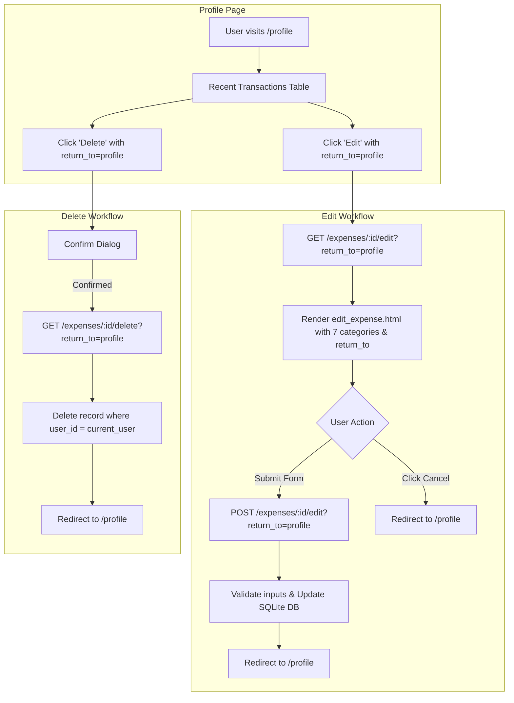

# Implementation Plan - 08 Improve Edit Expense Area in Profile

Enhance the Spendly User Profile page with direct transaction management capabilities (Edit and Delete action links in the Recent Transactions table), implement contextual return navigation (`return_to` handling for profile and dashboard), expand the edit expense form to support all 7 standard Spendly categories, and add comprehensive integration tests.

---

## Goal Description
Currently, users viewing their Recent Transactions on the `/profile` page can only view transactions in a read-only table without any action buttons. If they want to edit or delete a transaction, they must navigate to `/dashboard`. Furthermore, the existing `/expenses/<id>/edit` page only provides 5 of the 7 standard categories and always hardcodes a redirect back to `/dashboard` upon saving or canceling.

Step 08 improves this experience by:
1. **Adding an "Actions" column to Recent Transactions on `/profile`**: Each transaction row will have "Edit" and "Delete" buttons with proper confirmation prompts and styling.
2. **Contextual Return Navigation**: Supporting a safe `return_to` parameter across `edit_expense` and `delete_expense` so actions initiated from `/profile` seamlessly return users to `/profile` (and actions from `/dashboard` return to `/dashboard`).
3. **Category Standardization in Edit Form**: Updating `templates/edit_expense.html` to support all 7 Spendly categories (`Food`, `Transport`, `Bills`, `Health`, `Entertainment`, `Shopping`, `Other`) using the shared `CATEGORIES` constant.
4. **Context-Aware Cancel Button**: Updating the Cancel link in `edit_expense.html` to return to `/profile` or `/dashboard` matching `return_to`.
5. **End-to-End Test Suite**: Creating `tests/test_08-improve-edit-expense-in-profile.py` and updating `test_app.py` to ensure 100% clean test execution.

---

## User Review Required

> [!IMPORTANT]
> - **Safe Navigation Redirects**: `return_to` will be strictly validated against an allowed whitelist (`{"profile", "dashboard"}`) to prevent open redirect vulnerabilities.
> - **Ownership Verification**: All edit and delete operations strictly check `WHERE id = ? AND user_id = ?` to ensure users cannot manipulate transactions belonging to other accounts.
> - **Visual Consistency**: The Actions column and buttons in `profile.html` will reuse existing CSS classes (`.btn-action`, `.btn-delete`) and design variables (`var(--accent)`, `var(--border)`, `var(--ink)`) for seamless UI harmony.

---

## Architecture & Data Flow



---

## Proposed Changes

### Template Layer

#### [MODIFY] [templates/profile.html](file:///home/jiggra/expense-tracker/templates/profile.html)
- Add `<th class="text-right">Actions</th>` to the `<thead>` of `.expense-table`.
- Update each transaction `<tr>` to include an action cell:
  ```html
  <td class="text-right" style="white-space: nowrap;">
      <a href="{{ url_for('edit_expense', id=tx.id, return_to='profile') }}" class="btn-action">Edit</a>
      <a href="{{ url_for('delete_expense', id=tx.id, return_to='profile') }}" class="btn-action btn-delete" onclick="return confirm('Are you sure you want to delete this expense?')">Delete</a>
  </td>
  ```
- Update the empty state `colspan` from `4` to `5`.

#### [MODIFY] [templates/edit_expense.html](file:///home/jiggra/expense-tracker/templates/edit_expense.html)
- Update the category `<select>` element to render all 7 categories:
  ```html
  
  <option value="{{ cat }}" selected>{{ cat }}</option>
  
  ```
- Pass `return_to` in the form action:
  ```html
  <form method="POST" action="{{ url_for('edit_expense', id=expense.id, return_to=return_to) }}">
      <input type="hidden" name="return_to" value="{{ return_to }}">
      ...
  ```
- Update Cancel button:
  ```html
  <a href="{{ url_for('profile') if return_to == 'profile' else url_for('dashboard') }}" class="btn-ghost" style="display: block; text-align: center; margin-top: 0.75rem; width: 100%;">Cancel</a>
  ```

---

### Backend Application Layer

#### [MODIFY] [app.py](file:///home/jiggra/expense-tracker/app.py)

1. **In `edit_expense(id)`**:
   - Extract and sanitize `return_to`:
     ```python
     return_to = request.args.get("return_to") or request.form.get("return_to", "dashboard")
     if return_to not in ("profile", "dashboard"):
         return_to = "dashboard"
     ```
   - In `GET`: pass `categories=CATEGORIES`, `return_to=return_to` to `render_template("edit_expense.html", ...)`.
   - In `POST`:
     - Validate `category` is in `CATEGORIES`.
     - Validate positive float `amount > 0` and valid ISO `date`.
     - On error, re-render `edit_expense.html` passing `error`, `categories=CATEGORIES`, `return_to=return_to`, and modified form values.
     - On success, update record and redirect to `url_for(return_to)`.

2. **In `delete_expense(id)`**:
   - Extract and sanitize `return_to`:
     ```python
     return_to = request.args.get("return_to", "dashboard")
     if return_to not in ("profile", "dashboard"):
         return_to = "dashboard"
     ```
   - Delete verified expense and redirect to `url_for(return_to)`.

---

### Testing Layer

#### [NEW] [tests/test_08-improve-edit-expense-in-profile.py](file:///home/jiggra/expense-tracker/tests/test_08-improve-edit-expense-in-profile.py)
Create integration tests verifying:
1. `test_profile_renders_edit_and_delete_action_links`: Authenticated user on `/profile` sees Edit and Delete links with `return_to=profile` for their expenses.
2. `test_edit_expense_from_profile_loads_and_has_all_categories`: GET `/expenses/<id>/edit?return_to=profile` displays all 7 categories and has the cancel link pointing to `/profile`.
3. `test_edit_expense_from_profile_redirects_to_profile`: Submitting valid updates to `/expenses/<id>/edit?return_to=profile` redirects back to `/profile` and updates profile metrics.
4. `test_edit_expense_from_dashboard_redirects_to_dashboard`: Submitting updates without `return_to` or with `return_to=dashboard` redirects to `/dashboard`.
5. `test_delete_expense_from_profile_redirects_to_profile`: Deleting `/expenses/<id>/delete?return_to=profile` removes the record and redirects to `/profile`.
6. `test_edit_and_delete_unauthorized_user_blocked`: Users cannot edit or delete another user's expense from profile or dashboard.
7. `test_edit_expense_validation_errors`: Negative amount or invalid date preserves `return_to` and displays descriptive error.

---

## Verification Plan

### Automated Tests
Run pytest across the entire test suite:
```bash
.venv/bin/python -m pytest tests/test_08-improve-edit-expense-in-profile.py -v
.venv/bin/python -m pytest
```

### Manual Verification
1. Start development server: `.venv/bin/python app.py`.
2. Navigate to [http://127.0.0.1:5001/profile](http://127.0.0.1:5001/profile) while logged in.
3. Verify that the "Recent Transactions" table has the "Actions" column with "Edit" and "Delete" buttons.
4. Click "Edit" on a transaction -> confirm that all 7 categories appear in the dropdown.
5. Click "Cancel" -> confirm it returns to `/profile`.
6. Edit category, amount, or description and click "Save Changes" -> confirm it updates the database and redirects back to `/profile`.
7. Click "Delete" on a transaction -> confirm prompt appears, confirm deletion, and verify redirection back to `/profile` with updated metrics.
