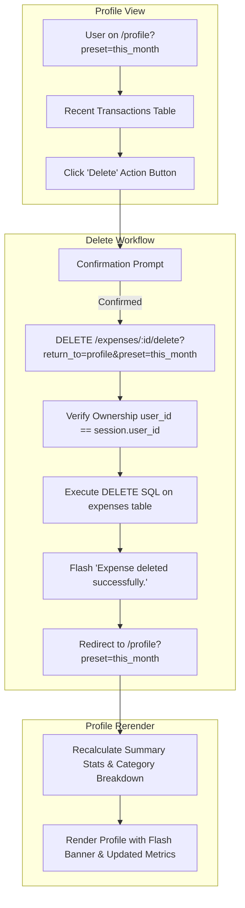

# Implementation Plan - 09 Updating Delete Expense Area in Profile

Enhance the Spendly User Profile page with a refined, secure expense deletion workflow. Introduce user confirmation, flash message feedback, preservation of active profile date filters (`preset`, `start_date`, `end_date`), support for both `POST` and `GET` deletion methods, and verify real-time metric updates across profile analytics.

---

## Goal Description
Currently, users on `/profile` can trigger an expense deletion, but the workflow has several limitations:
1. **Lost Filter Context**: When a user filters their profile transactions (e.g. `preset=last_3_months` or a custom date range `start_date`/`end_date`) and deletes an item, the redirection currently drops the filter query parameters and resets the view to default.
2. **Missing Feedback Notifications**: There is no flash message confirming the deletion action to the user.
3. **Limited HTTP Method Support**: The delete endpoint only explicitly handles `GET`, whereas supporting `POST` as well provides standard REST flexibility and security.
4. **Flash Message UI Support**: `base.html` lacks a standard flashed message banner container for application-wide notifications.

Step 09 addresses these by:
1. **Preserving Active Profile Filter State**: Passing active query parameters (`preset`, `start_date`, `end_date`) through the delete action to ensure users return to the exact same filtered state.
2. **Flash Notification System**: Adding standard flash messaging in `app.py` and styling in `templates/base.html` / `static/css/style.css` to confirm deletions ("Expense deleted successfully.").
3. **Dual-Method Support & Strict Security**: Supporting `POST` and `GET` in `delete_expense(id)` with strict `user_id` ownership checks and safe internal redirection validation.
4. **Immediate Profile Metric Recalculation**: Verifying that deleting an expense immediately updates total spent, transaction count, top category, and category breakdown.
5. **Comprehensive Test Suite**: Creating `tests/test_09-updating-delete-expense-area-in-profile.py` and ensuring a 100% clean test run.

---

## User Review Required

> [!IMPORTANT]
> - **Flash Messages Component in `base.html`**: A reusable flash message banner will be placed in `base.html` to render messages flashed via Flask's `flash()`, styled using Spendly design tokens (`--accent`, `--danger`, `--paper-card`, etc.).
> - **Filter Preservation**: When deleting from `/profile`, query parameters (`preset`, `start_date`, `end_date`) will be preserved so the user's active filter view is maintained.
> - **Security & Ownership**: The delete route strictly verifies `user_id == session['user_id']` and safely validates `return_to` destinations (`profile`, `dashboard`).

---

## Architecture & Data Flow



---

## Proposed Changes

### Template & UI Layer

#### [MODIFY] [templates/base.html](file:///home/jiggra/expense-tracker/templates/base.html)
- Add flashed messages block inside `<main class="main-content">` above ``:
  ```html
  
    
      <div class="flash-container">
        
          <div class="flash-message flash-{{ category }}">{{ message }}</div>
        
      </div>
    
  
  ```

#### [MODIFY] [templates/profile.html](file:///home/jiggra/expense-tracker/templates/profile.html)
- Update the delete button in the Recent Transactions table to pass active filter parameters (`preset`, `start_date`, `end_date`):
  ```html
  <a href="{{ url_for('delete_expense', id=tx.id, return_to='profile', preset=filters.preset if filters else '', start_date=filters.start_date if filters else '', end_date=filters.end_date if filters else '') }}" 
     class="btn-action btn-delete" 
     onclick="return confirm('Are you sure you want to delete this expense?')">Delete</a>
  ```

#### [MODIFY] [static/css/style.css](file:///home/jiggra/expense-tracker/static/css/style.css)
- Add styles for `.flash-container`, `.flash-message`, `.flash-success`, `.flash-danger`, and `.flash-info` using CSS custom properties (`var(--accent)`, `var(--danger)`, `var(--paper-card)`, `var(--border)`, etc.).

---

### Backend Application Layer

#### [MODIFY] [app.py](file:///home/jiggra/expense-tracker/app.py)
- Update `@app.route("/expenses/<int:id>/delete", methods=["GET", "POST"])`:
  - Support both `GET` and `POST` methods.
  - Parse and sanitize `return_to` parameter (allowed values: `profile`, `dashboard`).
  - Extract and forward active filter query parameters (`preset`, `start_date`, `end_date` for profile, `query`, `category`, `start_date`, `end_date`, `order_by` for dashboard).
  - Execute parameterized delete: `DELETE FROM expenses WHERE id = ? AND user_id = ?`.
  - Flash informative feedback messages ("Expense deleted successfully." or "Expense not found or unauthorized.").
  - Redirect cleanly with preserved filter query parameters.

---

### Testing Layer

#### [NEW] [tests/test_09-updating-delete-expense-area-in-profile.py](file:///home/jiggra/expense-tracker/tests/test_09-updating-delete-expense-area-in-profile.py)
Create comprehensive integration test suite covering:
1. `test_delete_expense_from_profile_redirects_and_flashes`: Deleting an expense from profile redirects to `/profile` with a success flash message and removes transaction.
2. `test_delete_expense_from_profile_preserves_preset_filter`: Deleting an expense with `preset=last_3_months` redirects to `/profile?preset=last_3_months`.
3. `test_delete_expense_from_profile_preserves_custom_date_filter`: Deleting an expense with `start_date` and `end_date` redirects to `/profile?start_date=...&end_date=...`.
4. `test_delete_expense_updates_profile_stats`: Deleting an expense updates total spent, transaction count, and category breakdown.
5. `test_delete_expense_via_post_method`: Verifies `POST /expenses/<id>/delete` functions identically.
6. `test_delete_expense_unauthorized_user`: A user cannot delete another user's expense.
7. `test_delete_expense_unauthenticated`: Accessing delete without login redirects to `/login`.

---

## Verification Plan

### Automated Tests
Run pytest across the dedicated test file and full test suite:
```bash
.venv/bin/python -m pytest tests/test_09-updating-delete-expense-area-in-profile.py -v
.venv/bin/python -m pytest
```

### Manual Verification
1. Start development server: `.venv/bin/python app.py`.
2. Login with `demo@spendly.com` / `demo123`.
3. Navigate to `/profile`.
4. Apply a filter preset (e.g. "This Month" or "Last 3 Months").
5. Delete a transaction from the Recent Transactions table.
6. Verify browser confirmation dialog appears.
7. Verify successful deletion, flash message display, preservation of filter preset in URL, and updated summary statistics.
